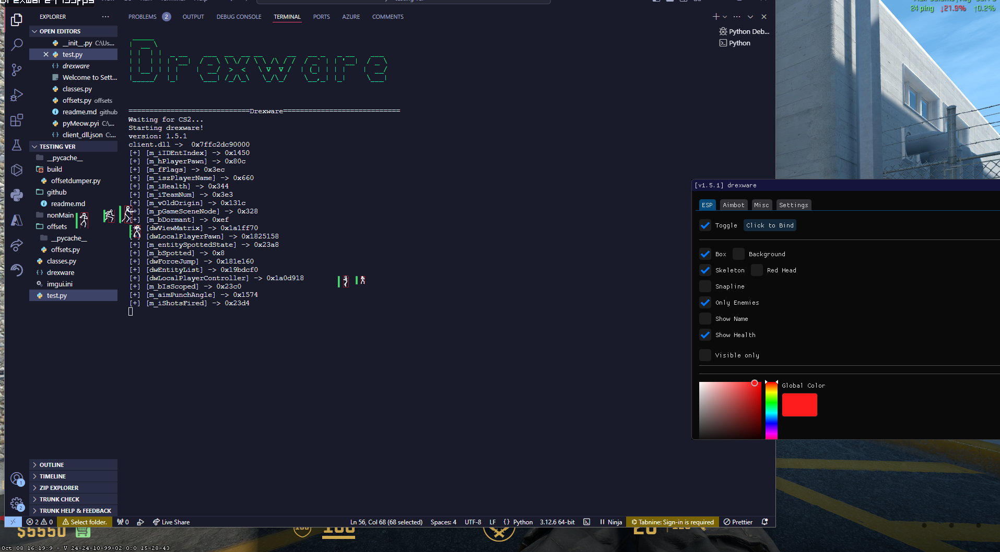

### V1.1.1 - Initial Release

- Initial version launched.

---

### V1.1.2 - Bug Fixes and Performance Improvements

- Fixed severe performance issues causing slow ESP rendering.
- Resolved key system bugs and general performance bottlenecks.

---

### V1.1.3 - Key System Overhaul

- Introduced a launcher with a custom key generation system.
- Enhanced ESP styling and optimized its performance.

---

### V1.1.4 - Aimbot Integration & UI Overhaul

- Switched from **pydeargui** to **PyQt5** for improved UI flexibility.
- Completely redesigned the menu with a new look and feel.
- Integrated an aimbot feature.

---

### V1.1.5 - New Features & Improvements

- Applied new CSS styling to the menu.
- Added feature toggles to enable or disable certain functionalities.

**New Features:**
1. Nametag ESP
2. Distance ESP
3. Health Bar
4. Aimbot Smoothing

---

### V1.1.6 - Aimbot Smoothness Enhancements

- Improved aimbot performance by introducing thread sleeps, leading to smoother operation.  
(Note: Aimbot still has minor bugs but overall functionality is acceptable.)

---

### V1.1.7 - Multithreading Test

- Began testing multithreaded functionality for improved performance.

---

### V1.2 - Complete rework

- Add new menu functionality.
-  Implement full multithreading support.
-  Add glow effect for ESP.
- Integrate TriggerBot.
-  Debug and polish overall system.
---
### v1.3.0 - Bhop and Fov changer

- Added bhop and Fov changer

- Added new toggle for each one
---
### v1.4.0 - Stylization update

- Added better gui styling
- updated esp styling
### v1.4.1 - mini ui update

- Added better gui styling
- added fov changer slider
---
### v1.4.2 - mini update
- Fixed bug with fov changer setting fov while scoped

### v1.5.0 - Added aimbot

- Added menu for aimbot and settings

### v1.5.1 - Added smooting slider
- Added smoothing slider

## **Bugs**
- 1. Visible only esp uses dw_EntitySpotted (which means it also activates if the team sees them it also activates)
---

## showcase

